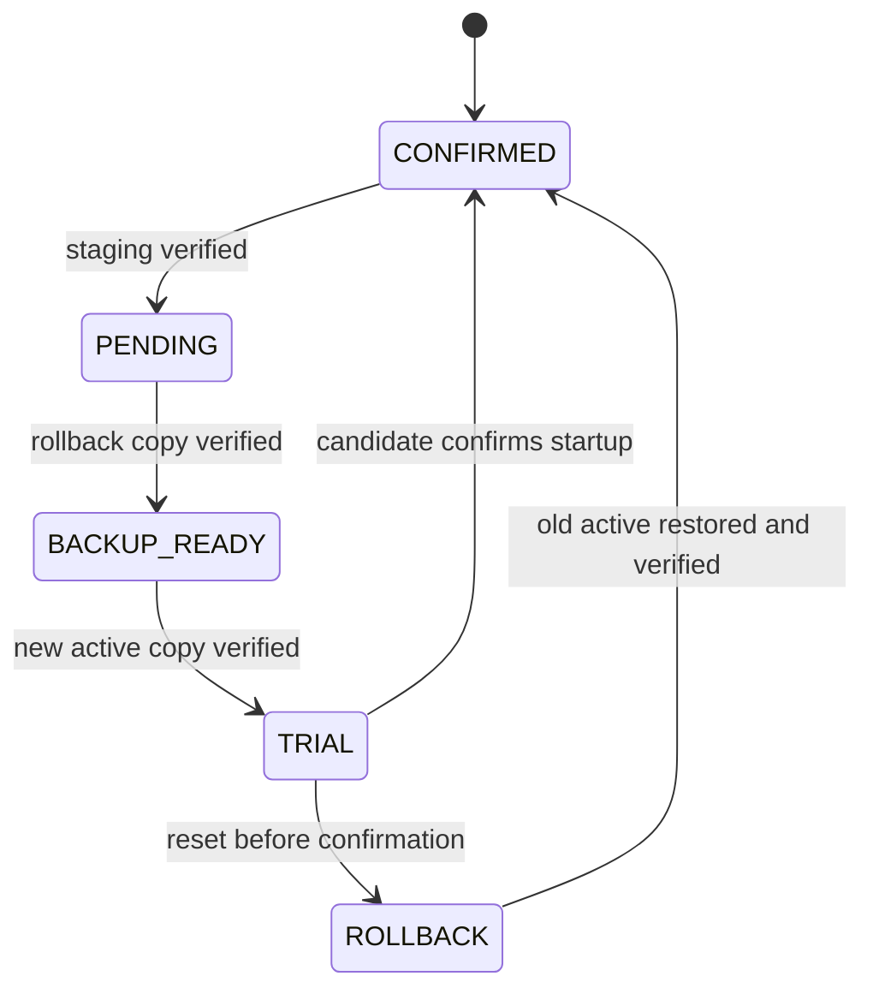

# Failure-safe RP2040 firmware updates

Status: proposed implementation plan. This describes updates to the RP2040
FPGA Manager firmware from the 65816 Core Manager. It is separate from FPGA
core installation.

## Goals

- Install a board-specific FPGA Manager update from the K2 without BOOTSEL or
  SWD after a one-time migration.
- Leave the currently working firmware untouched until the complete candidate
  has been received and verified.
- Survive loss of power during every erase, program, verification, metadata,
  installation, and rollback operation.
- Automatically return to the previous firmware if the candidate cannot reach
  a known-good startup point.
- Work without the RP2040 SD card. The update file can be read from the K2 SD
  card by `k2coremgr.pgz` and streamed through the FPGA mailbox.
- Preserve the four replaceable FPGA slots and existing boot-selection
  metadata.
- Retain BOOTSEL and SWD as recovery paths for the small first-stage loader
  itself.

The design does not attempt to protect against physical flash failure, an SWD
programmer erasing the device, or arbitrary code deliberately erasing the
first-stage loader. The RP2040 has no hardware flash protection or secure boot.

## Why a first-stage loader is required

The current FPGA Manager executes in place from QSPI flash at offset zero. It
can safely write other flash regions, as it already does for FPGA images, but
it cannot make overwriting its own executable power-failure-safe.

A small loader must therefore remain at flash offset zero. The normal FPGA
Manager is linked to a fixed application address above it. An update is first
written to staging. On reset, the loader—not the old or new application—moves
validated images between staging, active, and rollback regions.

The loader is normally immutable: in-system packages never contain or address
it. Updating the loader itself remains an explicit BOOTSEL or SWD operation.
Keeping this component small and stable is part of the recovery guarantee.

## Proposed flash layout

The board has 16 MiB of RP2040 QSPI flash. The upper 8 MiB remains unchanged:
four 2 MiB replaceable FPGA-image slots at offsets `0x800000`, `0xA00000`,
`0xC00000`, and `0xE00000`.

The lower 8 MiB becomes:

| Offset range | Size | Purpose |
| --- | ---: | --- |
| `0x000000-0x00FFFF` | 64 KiB | First-stage loader |
| `0x010000-0x27FFFF` | 2,496 KiB | Active application slot |
| `0x280000-0x4EFFFF` | 2,496 KiB | Last-known-good rollback slot |
| `0x4F0000-0x75FFFF` | 2,496 KiB | Incoming update staging slot |
| `0x760000-0x7FBFFF` | 624 KiB | Reserved; kept erased |
| `0x7FC000-0x7FCFFF` | 4 KiB | Update journal A |
| `0x7FD000-0x7FDFFF` | 4 KiB | Update journal B |
| `0x7FE000-0x7FEFFF` | 4 KiB | Existing boot metadata A |
| `0x7FF000-0x7FFFFF` | 4 KiB | Existing boot metadata B |

Each application slot starts with one 4 KiB manifest sector. The linked
application payload follows it. The maximum payload is therefore 2,492 KiB.
The present board-specific binaries are below 1 MiB, including their recovery
core. The build must fail if a future image exceeds the slot.

The normal application is linked for its active physical address. Staging and
rollback contain byte-for-byte copies of that active-address image; the loader
copies one into the active region before executing it. This avoids maintaining
two separately linked A/B executables.

A conventional bootloader that jumps directly between A and B slots is less
attractive on RP2040 because normal XIP executables contain absolute flash
addresses. The two slots would need separately linked payloads or a package
containing both variants. A fixed execution region plus staging and rollback
keeps one application binary while providing the same recovery properties;
installation takes an extra flash copy only during an update.

## Update bundle

Release builds produce one package per board revision:

```text
fpga_mgr_B0C_<version>.k2fw
fpga_mgr_B3B_<version>.k2fw
```

The package contains a manifest followed by the active-address application
payload. The manifest includes at least:

- magic and update-format version;
- target (`RP2040 FPGA Manager`) and board revision (`B0C` or `B3B`);
- firmware version and build identifier;
- required first-stage-loader ABI version;
- payload length and entry/vector offsets;
- SHA-256 of the payload;
- header CRC-32; and
- reserved signature-algorithm, key-ID, and signature fields.

Signing is not required for the initial implementation. The header CRC and
payload hash protect against storage and transfer corruption but do not prove
who produced a package. Reserving signature fields lets a later loader ABI add
authenticity without redesigning the package header. Because the first-stage
loader is normally immutable, enabling signature enforcement would still
require an explicit BOOTSEL or SWD loader upgrade.

The board identifier prevents a valid B0C package from being installed on a
B3B manager. The loader also checks that the initial stack pointer is in RP2040
SRAM, the reset vector is Thumb code inside the active application region, all
lengths are in range, and unused manifest bytes have the expected value.

## End-to-end flow

```mermaid
sequenceDiagram
    participant U as User
    participant C as K2 Core Manager
    participant F as FPGA mailbox
    participant A as Running FPGA Manager
    participant L as First-stage loader
    participant Q as RP2040 QSPI flash

    U->>C: Select board-specific .k2fw
    C->>A: Query board, version, loader ABI
    A-->>C: Compatible update information
    U->>C: Confirm firmware update
    loop Sequential chunks
        C->>F: Firmware data + offset
        F->>A: Mailbox command
        A->>Q: Program staging payload
        A-->>C: Committed offset
    end
    A->>Q: Verify header and payload hash; write manifest last
    A->>Q: Commit PENDING journal record
    A-->>C: Staged and verified
    C->>A: Apply/restart
    A->>L: Watchdog reset
    L->>Q: Copy active to rollback; verify
    L->>Q: Copy staging to active; verify
    L->>Q: Commit TRIAL record
    L->>A: Start candidate with trial watchdog
    A->>Q: Confirm after FPGA and supervisor initialization
```

### Staging while the old application is running

1. The Core Manager reads the package header and asks the running FPGA Manager
   for its board revision, firmware version, and loader ABI.
2. The FPGA Manager rejects a wrong board, incompatible loader ABI, malformed
   manifest, oversized payload, or disallowed downgrade before erasing staging.
3. The staging region is erased incrementally. Its manifest sector stays
   erased.
4. Payload commands are sequential and idempotent. Each response returns the
   next committed offset so a lost mailbox response can be retried safely.
5. The FPGA Manager verifies the complete payload hash and header CRC.
6. It writes and reads back the staging manifest sector last. Until this point
   staging cannot be mistaken for a valid image.
7. It writes a CRC-protected `PENDING` record to the alternating update journal.
   Only then does it report that the update is ready to apply.

An interruption in this phase leaves the active firmware and rollback slot
untouched. With no committed `PENDING` record, the loader ignores incomplete
staging and boots the current application.

### Installation in the first-stage loader

The update journal uses alternating erase sectors, monotonically increasing
sequence numbers, record CRCs, and readback verification, following the same
principle as the existing boot metadata.

The loader recognizes these states:

| State | Meaning | Loader action |
| --- | --- | --- |
| `CONFIRMED` or no update | Active is the accepted firmware | Validate and boot active |
| `PENDING` | Staging is valid; active is still old | Copy active to rollback and verify it |
| `BACKUP_READY` | Rollback is valid | Copy staging to active from the beginning and verify it |
| `TRIAL` | Candidate was installed but has not confirmed startup | Restore rollback, verify, mark confirmed, and boot it |

State transitions are committed only after the corresponding destination has
been completely verified:



Copying uses a 4 KiB RAM buffer. The source sector is read before the
destination sector is erased; each programmed page and final sector are read
back. The destination payload is copied first and its manifest sector is
committed last, so a partial active or rollback copy is not independently
valid. If power is lost, the last durable journal state causes the entire
current copy phase to restart. Repeating a phase is intentional and safe.

If both update-journal records are invalid, the loader never promotes staging
automatically. It tries a valid active image first, then restores a valid
rollback image. A valid staging image may be used only as the final
recovery candidate when active and rollback are both invalid. If no application
slot is valid, the loader enters RP2040 USB BOOTSEL recovery rather than jumping
into arbitrary flash.

### Trial boot and automatic rollback

Immediately before starting a candidate, the loader commits `TRIAL` and arms
the watchdog. The application must service the watchdog from early startup,
during SD/FPGA programming, and through supervisor initialization.

The candidate confirms itself only after:

- its board and active-slot manifest agree;
- an FPGA image has been programmed successfully; and
- the supervisor mailbox has initialized.

Confirmation writes a journal record containing the candidate build identifier
and then disables the trial watchdog. If the candidate crashes, hangs, or
resets before confirmation, the watchdog or next power cycle returns to the
loader. Seeing an unconfirmed `TRIAL`, the loader restores the verified
rollback image. A stale or different application cannot confirm the candidate
because the build identifier must match the journal.

## Mailbox protocol additions

Exact wire layouts belong in the authoritative FPGA mailbox specification.
The implementation needs these logical operations:

| Operation | Purpose |
| --- | --- |
| `FW_INFO` | Current version, board, loader ABI, update state, and last result |
| `FW_BEGIN` | Validate manifest and begin incremental staging erase |
| `FW_DATA` | Write a sequential chunk and return the committed offset |
| `FW_END` | Verify payload, write the staging manifest last, and commit `PENDING` |
| `FW_ABORT` | Abandon receiving state; active firmware is unchanged |
| `FW_APPLY` | Acknowledge, then restart the RP2040 into the loader |

Commands remain nonce-protected and bounded by the existing 240-byte mailbox
payload. Flash erasure, hash verification, and page programming must be
incremental so the FPGA transport continues to be serviced and the Core
Manager can render progress.

No command accepts an arbitrary flash address. The service chooses the fixed
staging region internally and rejects writes outside the declared payload.

## Core Manager user interface

The local K2 SD browser recognizes `.k2fw` as a firmware package, distinct from
`.bin` and `.gz` FPGA cores. A proposed `F6 Update manager` action is available
only on such a file. It shows a confirmation dialog with:

- detected board and package target;
- current and candidate firmware versions;
- whether this is an upgrade or an explicitly requested downgrade;
- the fact that the RP2040 will restart while the FPGA remains configured.

The update has separate progress stages: checking package, erasing staging,
uploading, verifying, backing up, installing, trial boot,
and confirmed/rolled back. Staging can be cancelled; installation after restart
cannot be cancelled safely and must be allowed to finish.

After `FW_APPLY`, the Core Manager tolerates the mailbox being unavailable for
the installation interval, polls for its return, then reads `FW_INFO`. The
result is explicit: updated and confirmed, rejected before installation, or
rolled back to the previous version. The result is also included in the F2
diagnostics view.

The first implementation reads `.k2fw` from the K2 SD card and therefore does
not depend on the optional RP2040 SD card. Staging directly from an RP2040-SD
file can be added later without changing the flash transaction.

## Failure analysis

| Interruption or fault | Expected result |
| --- | --- |
| Wrong-board or malformed package | Rejected before staging erase |
| Power loss while erasing or uploading staging | Existing active firmware boots |
| Corrupt transfer or package header/hash | `FW_END` fails; active is unchanged |
| Power loss while committing `PENDING` | Old journal record or valid `PENDING`; both are safe |
| Power loss copying active to rollback | `PENDING` repeats the backup copy; active is unchanged |
| Power loss committing `BACKUP_READY` | Backup phase repeats; active is unchanged |
| Power loss copying staging to active | `BACKUP_READY` repeats installation from staging |
| Power loss committing `TRIAL` | Installation repeats or the verified candidate is trialled |
| Candidate crashes or hangs during startup | Trial watchdog resets; rollback is restored |
| Power loss while restoring rollback | `TRIAL` causes rollback restoration to repeat |
| One update-journal sector is corrupt | The other valid sequence is used |
| Both update-journal sectors are corrupt | Validate active, then rollback; do not promote staging normally |
| Active and rollback are both invalid | Use valid staging only as recovery, otherwise enter USB BOOTSEL |

The first-stage loader and update journal must never share an erase sector with
an application image or existing boot metadata.

## Build and release changes

The build produces three kinds of board-qualified artifact:

- a factory/recovery UF2 and ELF containing the loader and a manifested active
  application for BOOTSEL or SWD installation;
- the small application update bundle (`.k2fw`) used by the Core Manager;
- the optional combined UF2 that additionally preloads the context-1 FPGA
  flash slot at offset `0x800000`.

The application uses a custom flash origin after the slot manifest. The linker
and package generator enforce all partition boundaries. A host-side inspection
tool prints and verifies package metadata, header CRC, and payload hash without
hardware.

The first update-capable release is a migration release. It must be installed
once through BOOTSEL or SWD because existing firmware has no protected loader
and occupies offset zero. That installation should write only the loader and
active application ranges, preserving the FPGA slots and boot metadata. Future
normal releases can then be installed from `.k2fw` inside the Core Manager.

## Implementation sequence

1. Define shared flash-layout, manifest, journal, and bootloader-ABI headers.
2. Add the relocated application linker layout and fail the build on overlap.
3. Build a minimal loader that validates and starts a factory-installed active
   application; produce combined UF2 and ELF artifacts.
4. Implement the journal and active/rollback/staging copy state machine with a
   host flash simulator and exhaustive reset injection.
5. Add on-device loader fault injection at every sector erase, page program,
   verification, and journal transition.
6. Add `.k2fw` generation and host-side inspection tools, retaining reserved
   fields for a future signature scheme.
7. Add incremental staging and status commands to the FPGA Manager mailbox.
8. Add `.k2fw`, confirmation, progress, restart, and result handling to the K2
   Core Manager.
9. Add trial-watchdog servicing and confirmation to normal manager startup.
10. Test the migration UF2/ELF and in-system updates on both B0C and B3B boards.
11. Update release documentation only after the destructive fault-injection
    matrix passes.

## Required validation matrix

- Normal upgrade, same-version reinstall, explicit downgrade, and wrong-board
  package on both B0C and B3B.
- Update with no RP2040 SD card and with an unreadable RP2040 SD card.
- Corruption of every manifest field, payload block, header CRC, and hash.
- Minimum, current, and maximum-size application payloads.
- Mailbox timeout, duplicate chunk, stale response, abort, and retry at every
  transfer offset.
- Forced reset or power removal after every flash erase, page program, verify,
  and journal write in backup, installation, confirmation, and rollback.
- Candidate builds that fail before FPGA programming, during FPGA programming,
  before supervisor initialization, and immediately before confirmation.
- Corruption of update journal A, journal B, both journals, active, rollback,
  and staging in every meaningful combination.
- Verification that offsets `0x7FE000-0x7FFFFF` and `0x800000-0xFFFFFF` are
  unchanged by firmware updates.
- BOOTSEL and SWD restoration from deliberately invalid application slots.

The release criterion is not merely that an update succeeds. At every injected
failure point, the device must boot either the old confirmed firmware or the
fully verified new firmware, or enter the documented ROM recovery path. It
must never jump into a partially programmed application.
