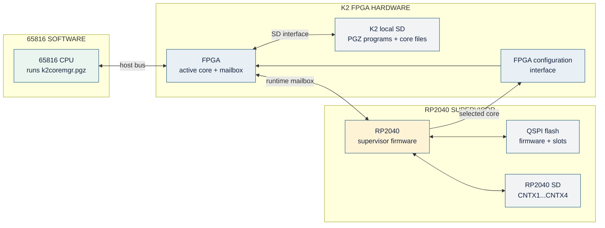

# K2 FPGA Manager

The K2 FPGA Manager is the boot and core-management system for the Wildbits/K2.
It consists of two cooperating programs:

| Component | Purpose |
| --- | --- |
| RP2040 supervisor firmware | Loads the FPGA at startup, maintains the core catalog and saved boot selections, programs replaceable flash, and records fallback diagnostics. |
| `k2coremgr.pgz` | K2 Core Manager application for browsing, copying, programming, selecting, and starting FPGA cores. |

The supervisor can use cores on its own SD card, one replaceable flash slot per
context, and an embedded recovery core shared by contexts 1 and 4. The K2
utility also sees the computer's normal SD card and can copy images in either
direction.

## Hardware variants

K2 hardware was produced by Wildbits and by Foenix Retro Systems (FRS). The
firmware target is determined by the revision printed on the PCB:

| Hardware | Revision |
| --- | --- |
| Wildbits K2 or FRS purple board | RevB0C |
| Earlier FRS black prototype board | RevB3B |

The Wildbits PCB is also black, so color alone does not distinguish it from an
FRS black board. Use the printed revision when choosing firmware. RevB0C and
RevB3B use different FPGA interfaces and their firmware is not interchangeable.

## Package contents

| File | Purpose |
| --- | --- |
| `K2-FPGA-MANAGER.pdf` | This installation and operating guide. |
| `fpga_mgr_B0C.uf2` / `.elf` | RevB0C factory firmware for BOOTSEL or SWD installation. |
| `fpga_mgr_B3B.uf2` / `.elf` | RevB3B factory firmware for BOOTSEL or SWD installation. |
| `fpga_mgr_B0C_<version>.k2fw` | RevB0C in-system FPGA Manager update. |
| `fpga_mgr_B3B_<version>.k2fw` | RevB3B in-system FPGA Manager update. |
| `k2coremgr.pgz` | Interactive K2 Core Manager application. |
| `LICENSE` | Project license. |

Both factory variants contain the same supervisor software and the matching K2
FPGA 02020105 2x core as the recovery environment for contexts 1 and 4. They do
not overwrite the four replaceable FPGA flash slots. The recovery payload is
stored only once in the RP2040 firmware.

Do not install firmware intended for the other board revision. The RP2040 will
still start, but its embedded recovery core will not produce working video.

The UF2 and ELF in this release include the protected first-stage loader. A K2
running older firmware must install the matching factory image once through
BOOTSEL or SWD. The `.k2fw` files update only the normal application and cannot
replace or damage that loader. Factory flashing also resets the dedicated
firmware-update journal so it is a reliable recovery operation, while leaving
core boot selections and the four replaceable FPGA slots alone.

## Install the supervisor firmware

### Through RP2040 BOOTSEL

1. Connect a USB cable with Dupont connectors to the internal RP2040 header in
   the K2 and connect the other end to a PC or Mac.
2. Hold the small BOOTSEL button next to the board connector while powering up
   the K2. The host should mount an `RPI-RP2` USB drive.
3. Copy the matching `fpga_mgr_B0C.uf2` or `fpga_mgr_B3B.uf2` to that drive.
4. Wait for the copy to finish and for the drive to disappear. The supervisor
   restarts and loads the FPGA according to the physical context switches and
   saved boot policy.

### With an SWD probe

Use this method when the internal BOOTSEL connection is damaged or the host
does not recognize the USB device. Connect a CMSIS-DAP probe, such as the
Raspberry Pi Debug Probe, to RP2040 SWDIO, SWCLK, and GND. From a command prompt
configured for the Raspberry Pi Pico SDK's OpenOCD installation, run the
command matching the board revision:

```text
openocd -f interface/cmsis-dap.cfg -f target/rp2040.cfg -c "adapter speed 5000" -c "program fpga_mgr_B0C.elf verify reset exit"
```

or:

```text
openocd -f interface/cmsis-dap.cfg -f target/rp2040.cfg -c "adapter speed 5000" -c "program fpga_mgr_B3B.elf verify reset exit"
```

## Install and start the K2 Core Manager

Copy `k2coremgr.pgz` to the K2's normal SD card and launch it as a PGZ program:

```text
/- k2coremgr
```

The running FPGA core must implement the RP2040 supervisor mailbox. The bundled
recovery core does. If the current core does not, the utility reports that the
supervisor is offline; press a key to restart the K2, select context 1 or 4,
and start the manager from the recovery environment.

## What is a context?

The K2 has four hardware contexts selected by the physical DIP switches. A
context selects both an FPGA core and one 512 KiB slice of the K2's 2 MiB NOR
flash. The FPGA core defines the machine's hardware, while the associated NOR
slice contains the firmware or operating environment visible in that context.
Changing context can therefore change the identity of the computer, not just
the program it starts.

For example, the K2 currently has a 65816-based 2x core and a 6809 core intended
for NitrOS-9. Each can occupy its own context, use its own NOR contents, and
boot as a distinct computer. Further K2-oriented cores can use the other
contexts in the same way.

Because the DIP switches also select the NOR slice, this is a physical machine
selection. The manager can prepare another context, but it cannot switch the
running K2 into it entirely in software. Change the switches and restart the K2
to use another context.

## How the pieces connect



`k2coremgr.pgz` runs on the 65816, the K2 SD card is attached to the FPGA
and is exposed to the program through the running core. Manager commands and
file data cross the FPGA mailbox link to the RP2040, which owns its separate
SD card and QSPI flash. At boot, or when a core is started from the manager,
the RP2040 sends the selected image back through the FPGA configuration
interface.

## Core storage and selection

Each context also has its own RP2040-SD directory, compressed-core slot in the
RP2040's QSPI flash, and saved boot selection. That QSPI slot is separate from
the K2 NOR slice. The manager may prepare any context, but can start only the
one selected by the DIP switches. Change the switches and restart the K2 to use
another context.

| Source | Contents and use |
| --- | --- |
| RP2040 manager SD | Core files under `CNTX1` through `CNTX4`. Missing directories are created automatically on a writable FAT16/FAT32 card. |
| Replaceable flash | One gzip image per context. Flash works without the manager SD card. |
| Embedded recovery | A board-specific known-good 2x core shared by contexts 1 and 4. It cannot be overwritten by normal core programming. |
| K2 local SD | Programs and core files visible to the 65816. The manager uses it to import images to, or export images from, the RP2040 SD card. |

RP2040-SD cores may be raw `.bin` files or gzip `.gz` files. Replaceable flash
accepts gzip images only, and the compressed file must fit in its 2 MiB slot.

## Keyboard reference

| Key | Action |
| --- | --- |
| `Up` / `Down` | Move the highlighted entry. |
| `Tab` | Switch between the RP2040 core catalog and the K2 local-SD browser. |
| `Left` / `Right` | Catalog: change context. Local SD: move backward or forward by ten entries. |
| `Enter` | Catalog: start the selected core once. Local SD: open a directory. |
| `F1` | Show the built-in help screen. |
| `F2` | Show the RP2040 boot and fallback log. |
| `F3` | Program the selected gzip image into the displayed context's replaceable flash slot. |
| `F5` | Local view: copy to RP2040 SD. Catalog: copy an SD, flash, or golden image to K2 SD. |
| `F7` | Save the selected catalog entry as the default without starting it. |
| `S` | Save the selected catalog entry as the default and start it. |
| `Delete` / `D` | Catalog: confirm and delete an RP2040-SD image. |
| `Backspace` / `Delete` | Local SD: return to the parent directory. |
| `F8` | Restart the RP2040 and repeat FPGA loading with the saved policy. |
| `U` | Local SD: stage or apply the highlighted `.k2fw` FPGA Manager update. |
| `R` | Refresh the current directory or catalog. |
| `Q` | Restart the K2 through the FPGA host-reset registers. |
| `RUN/STOP` | Close Help or Diagnostics, or cancel the read-only image-validation pass. |

The catalog marks the cursor with an amber triangle, the persistent default
with a green check, and the core that actually booted with an orange dot. The
running core can differ from the saved default when fallback was necessary.

## Common workflows

### Add a core to the manager SD

In the catalog, select the destination context with `Left` or `Right`. Then
press `Tab`, navigate to a `.bin` or `.gz` core on the K2 local SD, and press
`F5`. The manager validates the image, transfers it to a temporary file,
verifies byte count and CRC-32, and then installs it in the matching `CNTXn`
directory.

### Program replaceable flash

Highlight a gzip core in either SD-card view and press `F3`. From the catalog,
the source must be an RP2040-SD entry; from the local view, the image streams
directly from the K2 SD card, so this path still works when no manager SD card
is installed. Programming verifies every flash page and commits the image
header last. It does not change the saved boot selection or start the core.

### Test or select a core

In the catalog, press `Enter` to start a core once without changing the saved
selection. Press `F7` to make it the default without starting it, or `S` to save
and start it. Starting is rejected when the displayed context does not match
the physical switches; saving with `F7` is still allowed so another context can
be prepared before changing the switches.

### Copy a core back to the K2 SD card

In the catalog, press `F5` on an RP2040-SD image, the replaceable `FLASH`
image, or `GOLDEN`. The image is copied to the last directory visited in the
local-SD browser, or to the root directory if that browser has not yet been
used. The manager verifies byte count and CRC-32; flash readback must also match
the CRC recorded when the slot was programmed. It stages the transfer under a
hidden `.part` name, keeps an existing destination as a rollback copy, and
reopens the final path before reporting success. The progress dialog shows the
intended K2-SD path.

### Remove an RP2040-SD core

Highlight an SD entry in the catalog and press `Delete` or `D`. The manager asks
for confirmation and accepts `Y` only. Deleting a running image does not stop
the configured FPGA, but that file will no longer be available at the next
boot. Flash and embedded-recovery entries cannot be deleted this way.

### Update the FPGA Manager in-system

After the one-time loader migration, copy the `.k2fw` matching the physical
board revision to the K2 local SD card. Open it in the local-SD browser and
press `U`. The manager verifies the file shape, streams it into a fixed staging
slot, and shows progress. Before committing the update, the RP2040 checks the
board ID, loader compatibility, manifest CRC, flash readback, vectors, and
payload SHA-256.

Press `Y` at the final prompt to restart the RP2040 and install it. `RUN/STOP`
leaves the verified candidate staged; press `U` later to return to the prompt.
Because the pending update is already committed, any intervening RP2040
restart will install it. The old application is preserved as rollback, and an eight-second startup
watchdog automatically restores it if the candidate cannot load an FPGA and
bring up the supervisor mailbox. The optional RP2040 SD card is not used by
this update path.

## Boot policy and fallback

Each context stores one persistent boot selection:

- `AUTO` discovers a core on the RP2040 SD card and then tries replaceable
  flash.
- An exact SD selection tries that file first and falls back through mutable
  alternatives if it fails.
- `FLASH` tries the replaceable slot first and then automatic SD discovery.
- `GOLDEN`, available in contexts 1 and 4, starts their shared embedded 2x
  recovery core directly. It is the default for a fresh context-1 installation.

Contexts 1 and 4 add embedded recovery after failed SD and flash attempts.
Contexts 2 and 3 contain no embedded core. If one of those contexts cannot
boot, select context 1 or 4 with the physical switches, restart, and use the
manager to repair the failed context before switching back. Context 4 retains
the same recovery image for compatibility with the original K2 context layout;
the firmware stores only one copy.

The RP2040 SD card is optional. Without it, the supervisor can still boot a
valid replaceable flash image and contexts 1 and 4 can still reach embedded
recovery.

## Forced recovery and diagnostics

To force the immutable recovery image, select context 1 or 4 and hold the K2
RESET signal while the RP2040 starts. When the system is already running, holding
RESET for five seconds restarts the RP2040; keep RESET held through that restart
to request recovery.

Press `F2` to inspect the latest 32 boot and reconfiguration messages. The RAM
log records the saved policy, boot attempts, validation failures, fallbacks,
and loaded image; it is cleared when the RP2040 restarts.
